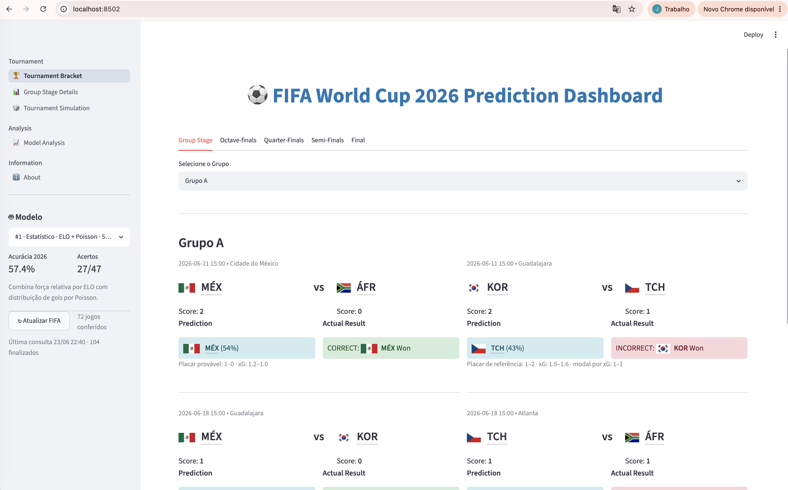

# FIFA World Cup 2026 Prediction Dashboard

Dashboard Streamlit para acompanhar resultados e comparar previsões de modelos
de machine learning e do ensemble estatístico ELO + Poisson.



## Execução

Requisitos:

- Python 3.10+
- Google Chrome ou Chromium, usado pelo RPA da FIFA

### Primeira execução ou atualização completa

```bash
python -m venv .venv
source .venv/bin/activate
pip install -r requirements.txt
python scripts/fetch_external_data.py
python scripts/train_models.py
streamlit run main.py
```

Ordem recomendada:

1. `python scripts/fetch_external_data.py` atualiza os datasets internacionais
   externos usados para enriquecer o treino.
2. `python scripts/train_models.py` treina e publica os artefatos em `models/`
   usando o recorte anti-leakage padrão: jogos internacionais desde 2010 até
   `2026-06-10`.
3. `streamlit run main.py` inicia o dashboard.

### Execução diária do dashboard

Se os datasets e modelos já estiverem atualizados, basta:

```bash
source .venv/bin/activate
streamlit run main.py
```

Ao abrir uma nova sessão, o aplicativo consulta a página oficial da FIFA e
atualiza `data/2026_world_cup_schedule.csv`. O botão **↻ Atualizar FIFA** permite
repetir a consulta manualmente sem reiniciar o dashboard.

Ou seja: você não precisa rodar o scraper da FIFA manualmente antes do
Streamlit; ele roda automaticamente ao abrir o app. Só rode
`scripts/fetch_external_data.py` e `scripts/train_models.py` quando quiser
atualizar as fontes externas e regenerar os modelos.

## Arquitetura

- `main.py`: composição do aplicativo, estado da sessão e sidebar.
- `app_pages/`: chaveamento, grupos, análise dinâmica e informações.
- `src/data/`: carga sanitizada dos dados, RPA Selenium e reconciliação do CSV.
- `src/models/`: catálogo, adaptadores e modelos estatísticos.
- `src/components/`: componentes visuais reutilizáveis.
- `tests/`: testes automatizados do parser, dados e modelos.

## Modelos

O seletor mostra todos os artefatos disponíveis em `models/`, além de
**ELO + Poisson**. Cada artefato ML combina dois estimadores:

- um **classificador** para prever `home_win`, `draw` e `away_win`;
- um **regressor multi-output** para prever `expected_goals_home` e
  `expected_goals_away`.

Ao trocar de modelo:

1. o preditor ativo muda imediatamente;
2. todas as partidas são recalculadas;
3. a acurácia de 2026 é recalculada;
4. a página **Model Analysis** passa a apresentar a heurística e os diagnósticos
   específicos daquele estimador.

O dataset histórico é sanitizado antes do uso: linhas vazias, resultados
inválidos e duplicatas são removidos.

## Treinamento dos modelos

O treinamento não depende de Jupyter, JupyterLab ou configuração de kernel.
Com o ambiente virtual ativo, execute:

```bash
python scripts/train_models.py
```

O pipeline:

1. carrega e sanitiza o histórico internacional expandido desde 2010 até
   `2026-06-10`, antes do início da Copa, mantendo equipes com pelo menos
   30 jogos no recorte para reduzir ruído de seleções regionais/não-FIFA;
2. mantém os jogos já finalizados da Copa 2026 fora do treino padrão para evitar
   data leakage na avaliação live;
3. cria features pré-jogo usando apenas partidas anteriores: médias de gols,
   forma recente, experiência histórica, ELO temporal, diferença de ELO,
   mando/campo neutro e importância do torneio;
4. reserva os 20% mais recentes para teste temporal;
5. treina Logistic Regression, Random Forest, Gradient Boosting, SVM, KNN e
   Naive Bayes;
6. treina um regressor de gols compatível com cada família de modelo;
7. cria um ensemble de votação com os três melhores;
8. calcula holdout, validação temporal, matriz de confusão, relatório por
   classe, MAE e RMSE de gols;
9. retreina os classificadores e regressores com todo o histórico e publica os
   bundles em `models/`
   de forma atômica.

Opções disponíveis:

```bash
python scripts/train_models.py --help
python scripts/train_models.py --test-size 0.25 --cv-folds 4
python scripts/train_models.py --no-ensemble
python scripts/train_models.py --include-current-2026
python scripts/train_models.py --data-source worldcup
python scripts/train_models.py --min-year 1992
python scripts/train_models.py --cutoff-date 2026-06-10
python scripts/train_models.py --min-team-matches 20
```

Use `--include-current-2026` apenas para simular previsões de jogos futuros
depois que parte da Copa já aconteceu. Não use essa opção para medir acurácia
nos próprios jogos de 2026 já concluídos, pois isso causa data leakage.
Use `--data-source worldcup` apenas se quiser reproduzir o treino antigo com
dados exclusivos de Copa do Mundo.

Depois do treinamento, reinicie o Streamlit para limpar o cache de recursos e
carregar os novos artefatos.

As versões de NumPy e scikit-learn usadas para persistência são registradas em
`models/models_metadata.json`. O `requirements.txt` fixa a versão do
scikit-learn para evitar incompatibilidade ao carregar arquivos pickle.

Para desenvolvimento e testes:

```bash
pip install -r requirements-dev.txt
pytest -q
```

## Atualização FIFA

O único scraper mantido é `src/data/fifa_scraper_selenium.py`. Ele:

- renderiza a página dinâmica da FIFA;
- extrai somente cartões com status finalizado;
- não utiliza resultados fictícios em caso de falha;
- concilia nomes e mando invertido;
- salva o CSV de forma atômica.

Consulte `docs/DATA_UPDATE_GUIDE.md` para detalhes operacionais.
